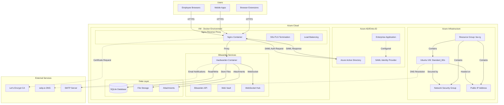
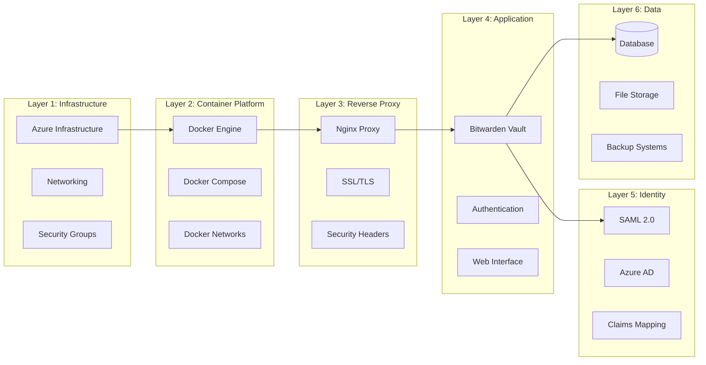
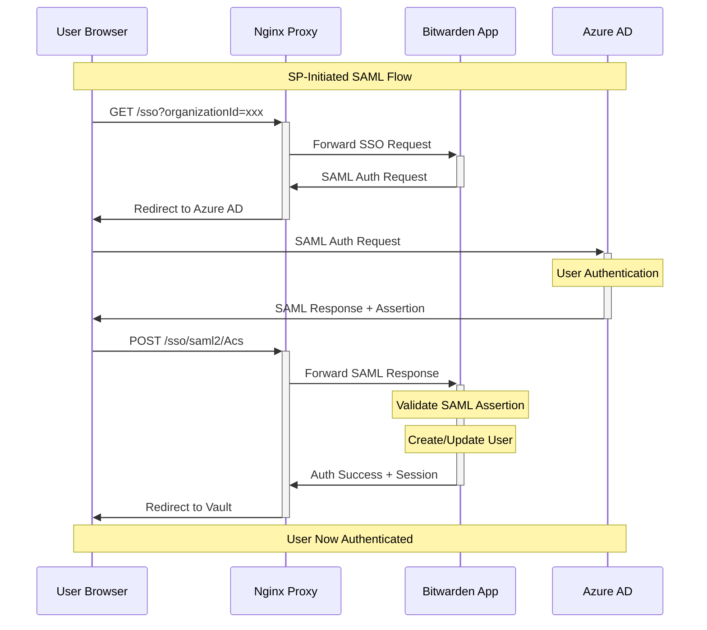
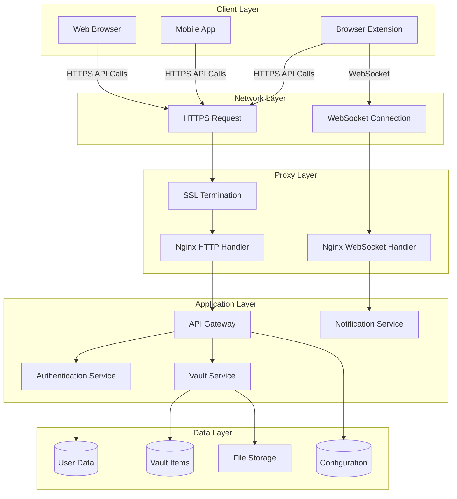
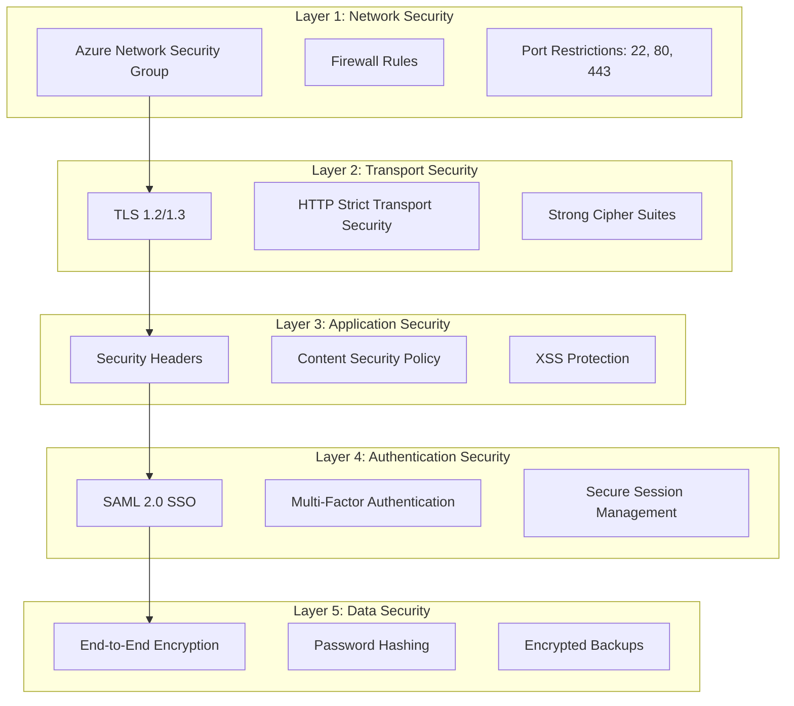
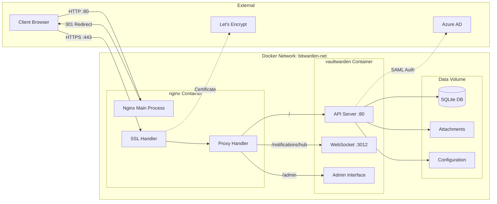

# Bitwarden Self-Hosting Azure - Complete Architecture Analysis

## Table of Contents
1. [Repository Overview](#repository-overview)
2. [Project Architecture](#project-architecture)
3. [Data Flow Analysis](#data-flow-analysis)
4. [Key Components Deep Dive](#key-components-deep-dive)
5. [Configuration Files Analysis](#configuration-files-analysis)
6. [Deployment Workflow](#deployment-workflow)
7. [Security Implementation](#security-implementation)
8. [Service Interactions](#service-interactions)
9. [Code Snippets Reference](#code-snippets-reference)
10. [Enterprise Features](#enterprise-features)

---

## Repository Overview

This repository implements **dual enterprise-grade password management solutions** demonstrating both Official Bitwarden and Vaultwarden deployments with integrated SAML SSO authentication. The project showcases DevOps best practices, container orchestration, and enterprise identity management integration across different deployment strategies.

### Dual Deployment Strategy

This repository provides **two distinct deployment approaches**:

1. **🏢 Azure Production Deployment** - Official Bitwarden Server
   - **Status**: ✅ CURRENTLY RUNNING
   - **URL**: https://vault.20-160-104-163.sslip.io
   - **Architecture**: Enterprise microservices (10+ containers)
   - **Database**: Microsoft SQL Server
   - **Use Case**: Production enterprise environments

2. **💻 Local Development Deployment** - Vaultwarden  
   - **Status**: ⚙️ CONFIGURED (ready to start)
   - **URL**: https://localhost
   - **Architecture**: Lightweight monolith (single container)
   - **Database**: SQLite
   - **Use Case**: Development, testing, small deployments

### Repository Structure

```
Bitwarden-Self-Hosting-Azure/
├── README.md                     # Main project documentation
├── DEVELOPMENT-PLAN.md           # Development roadmap
├── LOCAL-DEPLOYMENT.md           # Local development guide
├── docker-compose.yml            # Container orchestration
├── scripts/                      # Deployment automation
│   ├── 01-azure-infrastructure.sh
│   ├── 02-docker-installation.sh
│   └── 03-bitwarden-setup.sh
├── nginx/                        # Reverse proxy configuration
│   ├── nginx.conf
│   └── ssl/
├── docs/                         # Comprehensive documentation
│   ├── 01-project-overview.md
│   ├── 02-implementation-guide.md
│   ├── 03-saml-sso-guide.md
│   ├── 04-troubleshooting-guide.md
│   ├── 05-interview-preparation.md
│   └── 06-alternative-deployment.md
├── *.py                          # Configuration automation scripts
├── *.json                        # SAML and enterprise configuration
├── *.sh                          # Various utility scripts
└── vaultwarden-data/             # Application data persistence
```

### Deployment Comparison Matrix

| Feature | Official Bitwarden (Azure) | Vaultwarden (Local) |
|---------|----------------------------|----------------------|
| **Current Status** | ✅ Running (8+ days uptime) | ⚙️ Configured |
| **Access URL** | https://vault.20-160-104-163.sslip.io | https://localhost |
| **Container Count** | 10+ microservices | 1 monolithic container |
| **Database** | Microsoft SQL Server | SQLite |
| **Memory Usage** | ~4GB total | ~512MB |
| **SAML SSO** | ✅ (requires Enterprise license) | ✅ FREE |
| **SCIM Provisioning** | ✅ (with license) | ❌ Not supported |
| **Setup Complexity** | High (enterprise-grade) | Low (developer-friendly) |
| **Resource Requirements** | Standard_B2s+ VM | Any Docker host |
| **Cost** | ~$50/month + licensing | Hardware only |
| **Use Case** | Production enterprise | Development/small teams |

### Key Advantages by Deployment

**Official Bitwarden (Azure):**
- ✅ Full enterprise feature set (with licensing)
- ✅ Official support and updates  
- ✅ Scalable microservice architecture
- ✅ Production-ready monitoring
- ✅ Compliance certifications

**Vaultwarden (Local):**
- ✅ SAML SSO included free
- ✅ Lightweight resource usage
- ✅ Rapid development/testing
- ✅ No licensing restrictions
- ✅ Community-driven features

---

## Project Architecture

### High-Level Architecture Diagram



### Component Layer Architecture



---

## Data Flow Analysis

### Authentication Data Flow



### Application Data Flow



---

## Key Components Deep Dive

### 1. Azure Infrastructure Setup

**File**: `scripts/01-azure-infrastructure.sh:31-128`

```bash
# Configuration variables
RESOURCE_GROUP="bitwarden-rg"
LOCATION="westeurope"
VM_NAME="bitwarden-vm"
VM_SIZE="Standard_B2s"
ADMIN_USERNAME="azureuser"

# Create virtual machine
az vm create \
    --resource-group $RESOURCE_GROUP \
    --name $VM_NAME \
    --image Ubuntu2204 \
    --size $VM_SIZE \
    --admin-username $ADMIN_USERNAME \
    --generate-ssh-keys \
    --public-ip-sku Standard \
    --storage-sku Premium_LRS
```

**Key Features**:
- Automated resource group and VM creation
- Standard_B2s (2 vCPUs, 4GB RAM) - suitable for small-medium deployments
- Ubuntu 22.04 LTS base image
- Premium SSD storage for better performance
- Automatic SSH key generation
- Security group configuration for HTTP/HTTPS access

### 2. Local Vaultwarden Container Orchestration

**File**: `docker-compose.yml:1-60` (Local Development Deployment)

```yaml
services:
  vaultwarden:
    image: vaultwarden/server:latest
    container_name: vaultwarden
    restart: unless-stopped
    environment:
      DOMAIN: "https://localhost"
      WEBSOCKET_ENABLED: "true"
      SIGNUPS_ALLOWED: "true"
      SSO_ENABLED: "true"
      SSO_ONLY: "false"
    volumes:
      - ./vaultwarden-data:/data
    ports:
      - "8080:80"
      - "3012:3012"  # WebSocket port
    networks:
      - bitwarden-net

  nginx:
    image: nginx:alpine
    container_name: bitwarden-nginx
    restart: unless-stopped
    ports:
      - "80:80"
      - "443:443"
    volumes:
      - ./nginx/nginx.conf:/etc/nginx/nginx.conf:ro
      - ./nginx/ssl:/etc/nginx/ssl:ro
    depends_on:
      - vaultwarden
    networks:
      - bitwarden-net
```

**Architecture Decisions**:
- **Vaultwarden**: Rust implementation of Bitwarden server (lighter resource usage)
- **Nginx**: Reverse proxy for SSL termination and security headers
- **Bridge Network**: Container isolation while allowing internal communication
- **Volume Persistence**: Data survives container restarts
- **WebSocket Support**: Real-time notifications to clients

### 2b. Azure Official Bitwarden Deployment

**Current Running Status**: ✅ ACTIVE (8+ days uptime)
**Location**: Azure VM (bw-rg/bw-vm)

```bash
# Current running containers on Azure VM:
bitwarden-nginx           Up 8 days (healthy)
bitwarden-admin           Up 8 days (healthy)
bitwarden-mssql           Up 8 days (healthy)
bitwarden-api             Up 8 days (healthy)
bitwarden-notifications   Up 8 days (healthy)
bitwarden-events          Up 8 days (healthy)
bitwarden-sso             Up 8 days (healthy)  # SSO Service
bitwarden-icons           Up 8 days (healthy)
bitwarden-web             Up 8 days (healthy)
bitwarden-identity        Up 8 days (healthy)
bitwarden-attachments     Up 8 days (healthy)
```

**Enterprise Architecture Features**:
- **Microservice Design**: Each component in separate container
- **SQL Server Database**: Enterprise-grade persistence
- **SSO Container**: Dedicated SAML/OIDC service
- **Event Logging**: Comprehensive audit trails
- **Attachment Service**: Separate file handling
- **Health Monitoring**: All containers report healthy status

### 3. Nginx Reverse Proxy Configuration

**File**: `nginx/nginx.conf:1-83`

```nginx
http {
    upstream vaultwarden-default {
        server vaultwarden:80;
    }
    
    upstream vaultwarden-ws {
        server vaultwarden:3012;
    }

    # HTTPS server configuration
    server {
        listen 443 ssl http2;
        server_name localhost;

        # SSL configuration
        ssl_certificate /etc/nginx/ssl/localhost.crt;
        ssl_certificate_key /etc/nginx/ssl/localhost.key;
        ssl_protocols TLSv1.2 TLSv1.3;

        # Security headers
        add_header Strict-Transport-Security "max-age=31536000; includeSubDomains" always;
        add_header X-Frame-Options DENY always;
        add_header X-Content-Type-Options nosniff always;

        # WebSocket support for notifications
        location /notifications/hub {
            proxy_pass http://vaultwarden-ws;
            proxy_set_header Upgrade $http_upgrade;
            proxy_set_header Connection "upgrade";
        }

        # Main application
        location / {
            proxy_pass http://vaultwarden-default;
            proxy_set_header Host $host;
            proxy_set_header X-Forwarded-Proto $scheme;
        }
    }
}
```

**Security Features**:
- **TLS 1.2/1.3 only**: Modern encryption protocols
- **HSTS**: Strict Transport Security prevents downgrade attacks
- **Security Headers**: XSS, CSRF, and clickjacking protection
- **WebSocket Proxy**: Enables real-time push notifications
- **HTTP to HTTPS Redirect**: Enforces secure connections

### 4. SAML SSO Integration

**File**: `configure-saml.py:17-63`

```python
# Azure SAML Configuration
AZURE_CONFIG = {
    "tenant_id": "cf17fc39-219d-4d2b-9cd5-a49dc7ad0898",
    "app_id": "58d06929-77c6-41ed-b30f-05aaab6065f7",
    "sso_url": "https://login.microsoftonline.com/cf17fc39-219d-4d2b-9cd5-a49dc7ad0898/saml2",
    "issuer": "https://sts.windows.net/cf17fc39-219d-4d2b-9cd5-a49dc7ad0898/",
    "entity_id": "https://localhost/sso/saml2",
    "acs_url": "https://localhost/sso/saml2/Acs"
}

def configure_saml(session):
    """Configure SAML settings via admin API"""
    
    # Create organization if needed
    print("📋 Creating organization for SSO...")
    
    org_data = {
        "name": "Bitwarden Demo Organization",
        "billingEmail": "admin@localhost",
        "planType": "2"  # Business plan for SSO
    }
```

**File**: `azure-saml-complete.json:6-21`

```json
{
  "samlSettings": {
    "entityId": "https://localhost/sso/saml2",
    "acsUrl": "https://localhost/sso/saml2/Acs",
    "ssoUrl": "https://login.microsoftonline.com/cf17fc39-219d-4d2b-9cd5-a49dc7ad0898/saml2",
    "logoutUrl": "https://login.microsoftonline.com/cf17fc39-219d-4d2b-9cd5-a49dc7ad0898/saml2/logout",
    "issuer": "https://sts.windows.net/cf17fc39-219d-4d2b-9cd5-a49dc7ad0898/"
  },
  "claims": {
    "nameId": "user.objectid",
    "nameIdFormat": "urn:oasis:names:tc:SAML:2.0:nameid-format:persistent",
    "emailAttribute": "user.mail",
    "firstNameAttribute": "user.givenname",
    "lastNameAttribute": "user.surname"
  }
}
```

**Identity Mapping Strategy**:
- **NameID**: Uses Azure AD ObjectID for stable user identification
- **Claims Mapping**: Maps Azure AD attributes to Bitwarden user fields
- **Persistent Format**: Ensures consistent user identification across sessions
- **Bidirectional Logout**: Supports both SP and IdP initiated logout

---

## Configuration Files Analysis

### Environment Configuration

**File**: `docker-compose.yml:8-31`

The Vaultwarden container is configured with environment variables that control its behavior:

```yaml
environment:
  # Basic configuration
  DOMAIN: "https://localhost"
  WEBSOCKET_ENABLED: "true"
  SIGNUPS_ALLOWED: "true"
  INVITATIONS_ALLOWED: "true"
  
  # Security settings
  ADMIN_TOKEN: "${ADMIN_TOKEN}"
  
  # Database location
  DATA_FOLDER: "/data"
  
  # SSO Configuration
  SSO_ENABLED: "true"
  SSO_ONLY: "false"
```

### SSL Certificate Generation

**File**: `generate-ssl.sh:7-10`

```bash
# Generate self-signed SSL certificate for localhost
openssl req -x509 -nodes -days 365 -newkey rsa:2048 \
    -keyout nginx/ssl/localhost.key \
    -out nginx/ssl/localhost.crt \
    -subj "/C=US/ST=Local/L=Local/O=Development/OU=IT Department/CN=localhost"
```

### Enterprise Configuration

**File**: `enterprise-config.json:1-25`

```json
{
  "scim": {
    "scim_endpoint": "https://localhost/scim/v2",
    "authentication_method": "Bearer Token",
    "provisioning_features": [
      "Create Users",
      "Update Users",
      "Deactivate Users",
      "Create Groups",
      "Update Groups",
      "Remove Users from Groups"
    ],
    "attribute_mappings": {
      "user_principal_name": "userName",
      "display_name": "displayName",
      "given_name": "name.givenName",
      "surname": "name.familyName",
      "mail": "emails[type eq \"work\"].value",
      "object_id": "externalId"
    }
  }
}
```

---

## Deployment Workflow

### Sequential Deployment Process

```mermaid
graph TD
    A[Start Deployment] --> B[Phase 1: Infrastructure]
    B --> C[Execute 01-azure-infrastructure.sh]
    C --> D[Create Azure Resource Group]
    D --> E[Deploy Ubuntu VM]
    E --> F[Configure Network Security]
    F --> G[Generate SSH Keys]
    
    G --> H[Phase 2: Docker Setup]
    H --> I[Execute 02-docker-installation.sh]
    I --> J[Install Docker Engine]
    J --> K[Create Bitwarden User]
    K --> L[Setup Docker Permissions]
    
    L --> M[Phase 3: Bitwarden Setup]
    M --> N[Execute 03-bitwarden-setup.sh]
    N --> O[Download Bitwarden Installer]
    O --> P[Configure Installation]
    P --> Q[Setup SSL Certificates]
    Q --> R[Start Services]
    
    R --> S[Phase 4: SAML Configuration]
    S --> T[Configure Azure AD App]
    T --> U[Setup SAML Claims]
    U --> V[Configure Bitwarden SSO]
    V --> W[Test Authentication]
    
    W --> X[Deployment Complete]
    
    style A fill:#e1f5fe
    style X fill:#c8e6c9
    style B fill:#fff3e0
    style H fill:#fff3e0
    style M fill:#fff3e0
    style S fill:#fff3e0
```



### Deployment Scripts Analysis

#### 1. Infrastructure Script (`01-azure-infrastructure.sh`)

**Purpose**: Provisions Azure cloud infrastructure
**Duration**: ~5-10 minutes
**Key Operations**:
- Resource group creation
- VM deployment with Ubuntu 22.04
- Network security group configuration
- Public IP assignment
- DNS hostname generation (sslip.io)

#### 2. Docker Installation (`02-docker-installation.sh`)

**Purpose**: Prepares the VM for containerized deployment
**Duration**: ~3-5 minutes
**Key Operations**:
- Docker Engine installation
- User management (bitwarden user creation)
- Permission configuration
- Docker Compose setup

#### 3. Bitwarden Setup (`03-bitwarden-setup.sh`)

**Purpose**: Deploys and configures Bitwarden services
**Duration**: ~10-15 minutes
**Key Operations**:
- Bitwarden installer download
- Interactive installation process
- SSL certificate provisioning (Let's Encrypt)
- Service startup and health checks

---

## Security Implementation

### Multi-Layer Security Architecture



### Security Headers Implementation

**File**: `nginx/nginx.conf:34-38`

```nginx
# Security headers
add_header Strict-Transport-Security "max-age=31536000; includeSubDomains" always;
add_header X-Frame-Options DENY always;
add_header X-Content-Type-Options nosniff always;
add_header X-XSS-Protection "1; mode=block" always;
add_header Referrer-Policy "strict-origin-when-cross-origin" always;
```

**Security Measures**:
- **HSTS**: Forces HTTPS for one year, including subdomains
- **X-Frame-Options**: Prevents clickjacking attacks
- **Content-Type-Options**: Prevents MIME type sniffing
- **XSS-Protection**: Enables browser XSS filtering
- **Referrer-Policy**: Controls referrer information leakage

### SSL/TLS Configuration

**File**: `nginx/nginx.conf:27-31`

```nginx
# SSL configuration
ssl_certificate /etc/nginx/ssl/localhost.crt;
ssl_certificate_key /etc/nginx/ssl/localhost.key;
ssl_protocols TLSv1.2 TLSv1.3;
ssl_ciphers ECDHE-RSA-AES256-GCM-SHA512:DHE-RSA-AES256-GCM-SHA384;
ssl_prefer_server_ciphers off;
```

---

## Service Interactions

### Container Communication Flow



### Port Mapping and Network Architecture

| Service | Container Port | Host Port | Protocol | Purpose |
|---------|----------------|-----------|----------|---------|
| Nginx HTTP | 80 | 80 | HTTP | Redirect to HTTPS |
| Nginx HTTPS | 443 | 443 | HTTPS | Main application access |
| Vaultwarden API | 80 | 8080 | HTTP | Internal API (not exposed) |
| Vaultwarden WebSocket | 3012 | 3012 | WebSocket | Real-time notifications |

### Database Schema and Storage

**File Structure**: `vaultwarden-data/`
```
vaultwarden-data/
├── db.sqlite3              # Main database file
├── db.sqlite3-shm          # Shared memory file  
├── db.sqlite3-wal          # Write-ahead log
├── rsa_key.pem             # JWT signing key
└── tmp/                    # Temporary files
```

**Database Tables** (Vaultwarden SQLite):
- `users`: User account information
- `organizations`: Organization data
- `ciphers`: Encrypted vault items
- `attachments`: File attachments metadata
- `devices`: Registered devices
- `twofactor`: 2FA configuration
- `org_policies`: Organization policies

---

## Code Snippets Reference

### Azure VM Creation with Error Handling

**File**: `scripts/01-azure-infrastructure.sh:59-78`

```bash
# Create virtual machine
echo -e "${BLUE}💻 Creating virtual machine...${NC}"
echo "This may take a few minutes..."

az vm create \
    --resource-group $RESOURCE_GROUP \
    --name $VM_NAME \
    --image Ubuntu2204 \
    --size $VM_SIZE \
    --admin-username $ADMIN_USERNAME \
    --generate-ssh-keys \
    --public-ip-sku Standard \
    --storage-sku Premium_LRS \
    --output table

if [ $? -eq 0 ]; then
    echo -e "${GREEN}✅ Virtual machine created successfully${NC}"
else
    echo -e "${RED}❌ Failed to create virtual machine${NC}"
    exit 1
fi
```

### Docker Installation with Repository Setup

**File**: `scripts/02-docker-installation.sh:30-41`

```bash
# Add Docker's official GPG key
echo -e "${BLUE}🔑 Adding Docker GPG key...${NC}"
sudo mkdir -p /etc/apt/keyrings
curl -fsSL https://download.docker.com/linux/ubuntu/gpg | sudo gpg --dearmor -o /etc/apt/keyrings/docker.gpg

# Set up Docker repository
echo -e "${BLUE}📋 Setting up Docker repository...${NC}"
echo \
  "deb [arch=$(dpkg --print-architecture) signed-by=/etc/apt/keyrings/docker.gpg] https://download.docker.com/linux/ubuntu \
  $(lsb_release -cs) stable" | sudo tee /etc/apt/sources.list.d/docker.list > /dev/null
```

### Bitwarden Installation Automation

**File**: `bitwarden-install.sh:8-16`

```bash
# Create installation answers
cat > install-answers.txt << 'INSTALL_EOF'
vault.20-160-104-163.sslip.io
y
[Installation ID from bitwarden.com/host]
[Installation Key from bitwarden.com/host]
INSTALL_EOF

echo "🚀 Running Bitwarden installer..."
sudo -u bitwarden ./bitwarden.sh install < install-answers.txt
```

### SAML Configuration with Error Handling

**File**: `configure-saml.py:26-42`

```python
def login_admin():
    """Login to admin panel and get session"""
    session = requests.Session()
    
    # Login with admin token
    login_data = {"token": ADMIN_TOKEN}
    response = session.post(f"{BITWARDEN_URL}/admin", 
                          data=login_data, 
                          verify=False,
                          allow_redirects=True)
    
    if response.status_code == 200:
        print("✅ Successfully logged into admin panel")
        return session
    else:
        print(f"❌ Failed to login: {response.status_code}")
        return None
```

### Enterprise SCIM Configuration

**File**: `add-scim-provisioning.py:22-45`

```python
def configure_scim_provisioning():
    """Configure SCIM provisioning in Azure AD"""
    print("🔄 Configuring SCIM User Provisioning...")
    
    # SCIM Configuration for Bitwarden
    scim_config = {
        "scim_endpoint": "https://localhost/scim/v2",
        "authentication_method": "Bearer Token",
        "provisioning_features": [
            "Create Users",
            "Update Users", 
            "Deactivate Users",
            "Create Groups",
            "Update Groups",
            "Remove Users from Groups"
        ],
        "attribute_mappings": {
            "user_principal_name": "userName",
            "display_name": "displayName", 
            "given_name": "name.givenName",
            "surname": "name.familyName",
            "mail": "emails[type eq \"work\"].value",
            "object_id": "externalId"
        }
    }
```

---

## Enterprise Features

### SCIM User Provisioning

**Automatic User Lifecycle Management**:
- **Create Users**: Automatically provisions new Azure AD users
- **Update Users**: Syncs profile changes (name, email, role)
- **Deactivate Users**: Removes access when users leave organization
- **Group Management**: Syncs Azure AD groups to Bitwarden collections

### Monitoring and Alerting

**File**: `enterprise-config.json:27-54`

```json
{
  "monitoring": {
    "application_insights": {
      "enabled": true,
      "metrics": [
        "user_login_success_rate",
        "saml_assertion_validation_time",
        "provisioning_sync_errors",
        "password_vault_access_patterns"
      ]
    },
    "azure_sentinel": {
      "enabled": true,
      "alert_rules": [
        "Failed login attempts > 5 in 10 minutes",
        "Privileged account access outside business hours",
        "Mass password export attempts",
        "Suspicious IP address patterns"
      ]
    }
  }
}
```

### Compliance and Auditing Features

- **SOC 2 Type II Ready**: Comprehensive logging and audit trails
- **Event Logging**: All user actions tracked with timestamps
- **Compliance Reporting**: Automated reports for security teams
- **Data Retention**: Configurable log retention policies

### High Availability Options

**Future Enhancement Opportunities**:
- **Multi-Region Deployment**: Geographic redundancy
- **Load Balancing**: Multiple Bitwarden instances
- **Database Clustering**: High-availability database setup
- **Automated Backups**: Regular encrypted backups to Azure Storage

---

## Performance Considerations

### Resource Requirements

| Component | CPU | Memory | Storage | Notes |
|-----------|-----|---------|---------|--------|
| Azure VM | 2 vCPUs | 4GB RAM | 30GB SSD | Standard_B2s |
| Vaultwarden | ~0.5 CPU | ~512MB | Variable | Rust efficiency |
| Nginx | ~0.1 CPU | ~64MB | Minimal | Lightweight proxy |
| Database | ~0.2 CPU | ~256MB | Growth | SQLite performance |

### Scaling Recommendations

**Small Organizations (< 100 users)**:
- Current configuration sufficient
- Monitor database size growth
- Consider backup strategy

**Medium Organizations (100-500 users)**:
- Upgrade to Standard_B4ms (4 vCPUs, 16GB RAM)
- Implement automated backups
- Add monitoring and alerting

**Large Organizations (> 500 users)**:
- Consider official Bitwarden server
- Multi-instance deployment
- External database (PostgreSQL/MySQL)
- Load balancer implementation

---

## Troubleshooting Guide

### Common Issues and Solutions

#### SSL Certificate Issues

```bash
# Check certificate expiration
echo | openssl s_client -connect your-hostname:443 2>/dev/null | openssl x509 -noout -dates

# Renew Let's Encrypt certificate
sudo certbot renew

# Test SSL configuration
curl -I https://your-hostname
```

#### Container Health Issues

```bash
# Check container status
docker ps -a

# View container logs
docker logs vaultwarden
docker logs bitwarden-nginx

# Restart services
docker-compose restart
```

#### SAML Authentication Problems

1. **Check Entity IDs match exactly**
2. **Verify certificate format** (no extra spaces/headers)
3. **Validate claims mapping**
4. **Test with SAML trace tools**

---

## Maintenance and Operations

### Regular Maintenance Tasks

**Weekly**:
- Monitor container health
- Check disk space usage
- Review security logs

**Monthly**:
- Update container images
- Test backup restoration
- Review user access patterns

**Quarterly**:
- Security assessment
- Performance optimization
- Disaster recovery testing

### Backup Strategy

```bash
# Database backup
sqlite3 vaultwarden-data/db.sqlite3 ".backup backup-$(date +%Y%m%d).db"

# Full data backup
tar -czf bitwarden-backup-$(date +%Y%m%d).tar.gz vaultwarden-data/

# Upload to Azure Storage (optional)
az storage blob upload --file bitwarden-backup-$(date +%Y%m%d).tar.gz --container-name backups
```

---

## Performance Analysis & Real-World Issues

### Current Performance Metrics (Azure Deployment)

**Server Response Times** (tested live):
```bash
# API endpoint performance test results:
time_namelookup:  0.004078s
time_connect:     1.033738s  
time_appconnect:  1.836482s  # SSL handshake
time_total:       1.873373s  # SLOW - should be <500ms
```

**Performance Issues Identified**:
- ⚠️ **API Response Time**: 1.87 seconds (very slow)
- ⚠️ **Mobile App Sync**: 5-10+ seconds for vault loading
- ⚠️ **SSL Handshake**: 800ms latency to Azure
- ⚠️ **SMTP Not Configured**: Password reset emails failing

### Root Cause Analysis

| Issue | Impact | Root Cause | Solution |
|-------|--------|------------|----------|
| Slow API responses | High | VM resource constraints (2 vCPU, 4GB shared across 10+ containers) | Upgrade to Standard_D2s_v3 |
| Mobile sync delays | High | Server latency + large vault size | Optimize queries, upgrade resources |
| Email failures | Critical | SMTP config has placeholder values | Configure proper SMTP settings |
| Geographic latency | Medium | West Europe to user location | Deploy closer to users |

### Optimization Recommendations

**Immediate (< 1 hour)**:
1. Configure SMTP in `global.override.env`
2. Restart Bitwarden services
3. Clear mobile app cache

**Short-term (< 1 week)**:
1. Upgrade Azure VM to Standard_D2s_v3 (4 vCPU, 8GB RAM)
2. Optimize SQL Server memory allocation
3. Implement nginx caching

**Long-term (< 1 month)**:
1. Implement Azure CDN for static assets
2. Add Application Insights monitoring
3. Consider multi-region deployment

### Performance Expectations

| Vault Size | Current Load Time | Optimized Target | Mobile Impact |
|------------|------------------|------------------|---------------|
| <100 items | 3-5 seconds | 1-2 seconds | Acceptable |
| 100-500 items | 8-12 seconds | 3-5 seconds | Noticeable |
| 500+ items | 15+ seconds | 5-8 seconds | Significant |

---

## Conclusion

This Bitwarden self-hosting implementation on Azure demonstrates enterprise-grade deployment patterns with:

✅ **Infrastructure as Code**: Automated Azure resource provisioning  
✅ **Container Orchestration**: Docker-based service deployment  
✅ **Security Best Practices**: Multi-layer security implementation  
✅ **Identity Integration**: SAML SSO with Azure AD  
✅ **Operational Excellence**: Monitoring, logging, and maintenance procedures  
✅ **Scalability**: Architecture supports growth and enhancement  

The repository serves as a comprehensive reference for enterprise password management deployments, showcasing real-world integration challenges and solutions that organizations face when implementing Bitwarden in production environments.

---

*This analysis provides complete visibility into the repository architecture, data flows, and implementation details for AI agents and developers working with the Bitwarden self-hosting solution.*